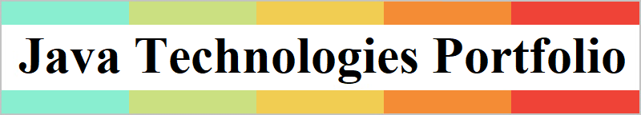

| _Repository_ | _Main Topics_ |
| :---: | :--- |
| <a href="https://github.com/k1729p/Miscellany">Miscellany</a> |  |
| <a href="https://github.com/k1729p/Study01">Study01</a> | <b>SpringBoot</b> ● <b>OpenAPI</b> ● Stoplight ● Swagger UI ● YAML |
| <a href="https://github.com/k1729p/Study02">Study02</a> | <b>Docker</b> ● <b>SpringBoot</b> ● <b>Reactive</b> REST Web Service ● Reactive Mongo Repository |
| <a href="https://github.com/k1729p/Study03">Study03</a> | <b>Docker</b> ● <b>SpringBoot</b> ● <b>Reactive</b> REST Web Service ● Spring WebFlux ● Redis |
| <a href="https://github.com/k1729p/Study04">Study04</a> | <b>Docker</b> ● <b>Kafka</b> ● Apache Kafka Streams |
| <a href="https://github.com/k1729p/Study05">Study05</a> | <b>Docker</b> ● <b>SpringBoot</b> ● <b>Kafka</b> ● Spring Cloud Stream |
| <a href="https://github.com/k1729p/Study06">Study06</a> | <b>Docker</b> ● <b>SpringBoot</b> ● <b>Camunda</b> |
| <a href="https://github.com/k1729p/Study07">Study07</a> | <b>SpringBoot</b> ● RESTful Web Service ● HATEOAS ● <b>Spring Data REST</b> ● H2 database |
| <a href="https://github.com/k1729p/Study08">Study08</a> | <b>SpringBoot</b> ● Spring Web MVC ● Thymeleaf |
| <a href="https://github.com/k1729p/Study09">Study09</a> | <b>SpringBoot</b> ● RESTful Web Service ● HATEOAS ● <b>JavaScript</b> ● AngularJS ● jQuery |
| <a href="https://github.com/k1729p/Study10">Study10</a> | <b>SpringBoot</b> ● Spring Cloud Netflix Microservices ● Eureka Server ● Resilience4j |
| <a href="https://github.com/k1729p/Study11">Study11</a> | <b>SpringBoot</b> ● <b>SOAP</b> Web Services ● Spring Web Services ● WSDL |
| <a href="https://github.com/k1729p/Study12">Study12</a> | Swing ● Bean Validation ● CDI ● JBoss Weld Container ● Jakarta RESTful Web Services ● JAX-RS |
| <a href="https://github.com/k1729p/Study13">Study13</a> | <b>JBoss WildFly</b> ● Jakarta EE ● EJB ● JPA ● JMS ● Transactions (CMT, BMT) ● H2 database |
| <a href="https://github.com/k1729p/Study14">Study14</a> | <b>JBoss WildFly</b> ● CDI ● JAX-WS ● JAX-RS ● WSDL ● JSF |
| <a href="https://github.com/k1729p/Study15">Study15</a> | <b>Solr</b> ● JSON |
| <a href="https://github.com/k1729p/Study16">Study16</a> | <b>Docker</b> ● <b>Elasticsearch</b> ● JSON |
| <a href="https://github.com/k1729p/Study17">Study17</a> | <b>Docker</b> ● <b>MapStruct</b> ● Apache Commons ● Concurrent Trees ● Eclipse Collections |
| <a href="https://github.com/k1729p/Study18">Study18</a> | Security |
| <a href="https://github.com/k1729p/Study19">Study19</a> | Mathematics ● Statistics |
| <a href="https://github.com/k1729p/Study20">Study20</a> | Java Platform Module System |
| <a href="https://github.com/k1729p/Study21">Study21</a> | <b>Docker</b> ● <b>Pulsar</b> ● Testcontainers |
| <a href="https://github.com/k1729p/Study22">Study22</a> | <b>Docker</b> ● <b>Kubernetes</b> ● <b>Quarkus</b> ● <b>Kafka</b> ● MongoDB ● PostgreSQL |

Using [Java version 21](https://docs.oracle.com/en/java/javase/21/docs/api/index.html) (LTS). 
The code quality was reviewed ( [screenshot](images/Screenshot-SonarQube1.png) , [screenshot](images/Screenshot-SonarQube2.png) ) by [SonarQube](https://www.sonarqube.org/). :heavy_check_mark: 
The projects were built with [Maven](https://maven.apache.org/). The testing was done with [JUnit 5](https://junit.org/junit5/).

The [legacy](https://github.com/k1729p/legacy) repository (EJB, Hibernate, Seam, Spring)  [<b>𝐏𝐨𝐫𝐭𝐟𝐨𝐥𝐢𝐨 𝐖𝐢𝐤𝐢</b>](https://github.com/k1729p/Portfolio/wiki)